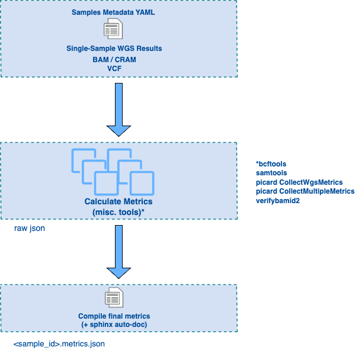

# NPM-sample-qc

NPM-sample-qc is a [Nextflow](https://www.nextflow.io/) workflow to obtain QC metrics from single-sample WGS results. It has been created to support QC efforts within the National Precision Medicine programme in Singapore (NPM). In collaboration with [GA4GH](https://www.ga4gh.org/), the [WGS Quality Control Standards](https://www.ga4gh.org/product/wgs-quality-control-standards/) was formed with this workflow as first reference implementation of the standards.

## Requirements

- [Install Nextflow](https://www.nextflow.io/docs/latest/getstarted.html#installation)

v23.10.4 or higher:
```  
  # Download the executable package
  wget -qO- https://github.com/nextflow-io/nextflow/releases/download/v23.10.4/nextflow-23.10.4-all | bash
  # Make the binary executable on your system
  chmod -x nextflow
  # Optionally, move the nextflow file to a directory accessible by your $PATH variable
  mv nextflow /usr/local/bin
```
- [Install Docker](https://docs.docker.com/get-docker/)
- Install and configure [AWS CLI](https://docs.aws.amazon.com/cli/latest/userguide/getting-started-install.html)

## Quick start

Clone this repository ::
```
  git clone git@github.com:c-BIG/NPM-sample-qc.git
```
Run workflow on 45Mbp region around AKT1 gene, 30X, of sample NA12878 from the 1000 Genomes Phase 3 Reanalysis with DRAGEN 3.7 ::
```
  # Move to test folder
  cd tests/NA12878-chr14-AKT1_1000genomes-dragen-3.7.6/
  # Run the workflow
  sh run.sh
```
This creates `output` directory with the results that can be compared to the content of `output_certified` ::
```
  diff output_certified/results/metrics/NA12878-chr14-AKT1.metrics.json output/results/metrics/NA12878-chr14-AKT1.metrics.json
```
Please refer to the workflow help for more information on its usage and access to additional options: ::
```
  nextflow run NPM-sample-qc/main.nf --help
```
## Understanding the workflow

### Resources

The workflow requires the following resources given in the ``conf/resources.config``

- N-regions reference file, used as an input for computing "non-gap regions autosome" coverages (picard, bcftools).

  - Gaps in the GRCh38 (hg38) genome assembly, defined in the AGP file delivered with the sequence, are being closed during the finishing process on the human genome. GRCh38 (hg38) genome assembly still contains the following principal types of gaps:

    - short_arm - short arm gaps (count: 5; size range: 5,000,000 - 16,990,000 bases)
    - heterochromatin - heterochromatin gaps (count: 11; size range: 20,000 - 30,000,000 bases)
    - telomere - telomere gaps (count: 48; all of size 10,000 bases)
    - contig - gaps between contigs in scaffolds (count: 285; size range: 100 - 400,000 bases)
    - scaffold - gaps between scaffolds in chromosome assemblies (count: 470; size range: 10 - 624,000 bases)

  - Gaps in the GRCh38 (hg38) genome assembly were downloaded from http://hgdownload.soe.ucsc.edu/goldenPath/hg38/database/gap.txt.gz (``2019-03-11 09:51, 12K``).         

- Human Reference Genome FASTA file, used as an input for multiple tools. This file can be downloaded from ``s3://broad-references/hg38/v0/Homo_sapiens_assembly38.fasta``.

- FASTA file index. This file can be downloaded from ``s3://1000genomes-dragen-3.7.6/references/fasta/hg38.fa.fai`` and not required to be specified in the config. The workflow will look fasta index file in a folder the fasta file is present.

- Verify Bam ID 2 reference panel files, 100K sites from 1000 Genome Project phase 3 build 38, downloaded from ``https://github.com/Griffan/VerifyBamID/tree/master/resource/``.

### Inputs

Input requirements can be split into two categories:

- **Generic workflow settings** specify parameters that will not vary from run to run, e.g. Nextflow profile declarations, trace/timeline/report/dag options, output structure and paths to data resources. See ``nextflow.config`` for additional details.

- **Sample-specific settings** contain paths to WGS data for a given sample, namely BAM/CRAM and/or VCF. The workflow expects the BAM/CRAM index (bai/crai) and/or VCF index (tbi) to be present in the same location. See ``tests/NA12878-chr14-AKT1_1000genomes-dragen-3.7.6/params.yaml`` for an example.

If accessing AWS S3 public resources (for example reference genome .fa, .fai or bam/cram) without any AWS user credential, 
append ``aws_no_sign_request: true`` to your parameter list (``params.yaml`` or commandline argument).
See ``tests/NA12878_1000genomes-dragen-3.7.6/params.yaml`` for an example. 

### Outputs

Upon completion, the workflow will create the following files in the ``outdir`` directory: ::
```
  /path/to/outdir/
      pipeline_info/    # dag, timeline and trace files
          dag.dot
          report.html
          timeline.html
          trace.txt
      results/          # final metrics.json and intermediate outputs
          bcftools/
          metrics/
            <sample_id>.metrics.json
          picard_collect_multiple_metrics/
          picard_collect_wgs_metrics/
          samtools/
          verifybamid2/
```
If ``cleanup = true`` in the nextflow.config is commented out, the contents of the Nextflow work directory (``work-dir``) will also be preserved.

### Docker image

By default the workflow pull the docker image from dockerhub. However you can also build docker image locally ::
```
  # Move to containers
  cd containers
  # Build docker image locally
  sh build_npm-sample-qc_docker_image.sh
```
## Workflow logic

We provide a schematic representation of the workflow in the figure below:
  
.. raw:: html

      

In a nutshell, this workflow generates QC metrics from single-sample WGS results in three stages: **metrics calculation**, **parsing of intermediate outputs** and **generation of a final report**. This makes it possible to take full advantage of the parallelisation capabilities of Nextflow, allows users to leverage third-party tools or add custom scripts, and enables auto-documentation of metrics from code comments.

**Metrics calculation**

The current workflow combines widely-used third-party tools (samtools, picard, bcftools, verifybamid2) and custom scripts. Full details on which processes are run/when can be found in the actual workflow definition (``main.nf``). We also provide an example dag for a more visual representation (``tests/NA12878_1000genomes-dragen-3.7.6/dag.pdf``).

**Metrics parsing**

Next, output files from each individual tool are parsed and combined into a single json file.

## Metric definitions

The full list of metrics reported by this workflow and details on how they've been calculated can be found [here](https://c-big.github.io/NPM-sample-qc/metrics.html).

When needed, page contents can be updated by running the following command: ::
```
  # Install sphinx
  pip install sphinx_rtd_theme sphinx_automodapi
  # Move to doc source
  cd docsrc
  # Build the doc
  ./build.sh
```
## Citations

In this work, we utilized the Nextflow workflow engine, as described by P. Di Tommaso et al. Nextflow enables reproducible computational workflows. Nature Biotechnology 35, 316–319 (2017) [doi:10.1038/nbt.3820](https://www.nature.com/articles/nbt.3820)


## Disclaimer

This product provides a reference implementation of quality control metrics. Implementers are responsible for ensuring that any use involving data complies with their local institutional policies, data sharing agreements, and legal or ethical obligations, especially in contexts involving sensitive or personally identifiable information.

The QC metrics JSON output should include a reference to a sample or WGS library identifier. We recommend that implementers avoid inadvertently disclosing in this identifier potentially sensitive or identifiable information and to leverage other GA4GH products (e.g., those from the Experiments Metadata Standard Working Group) to provide linkage between this identifier and upstream sample information which might be sensitive or provide a mean for unconsented or unaligned with legal or other obligation requirements identification.
